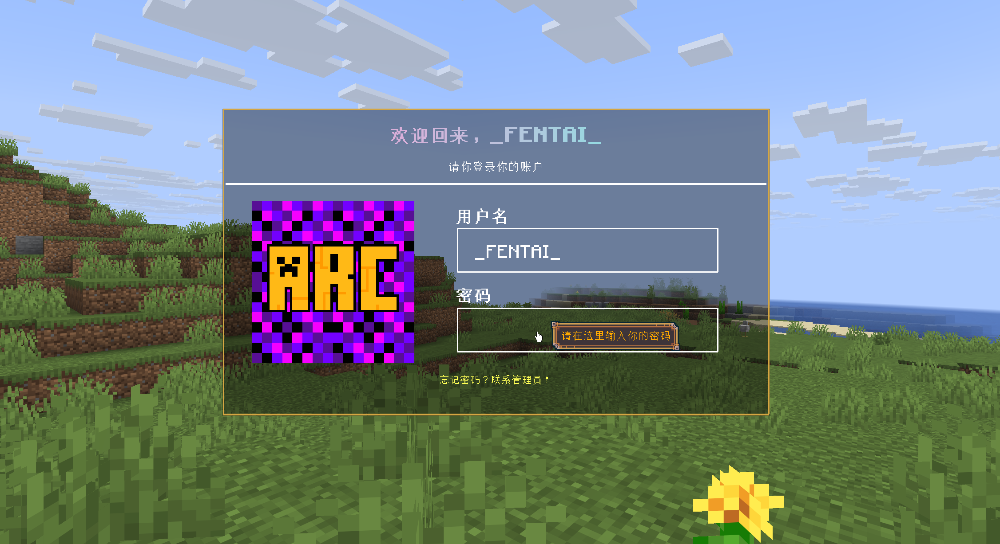
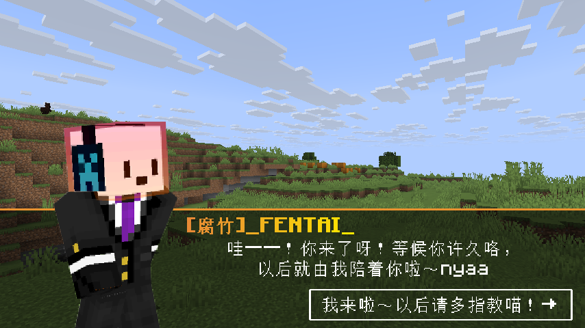
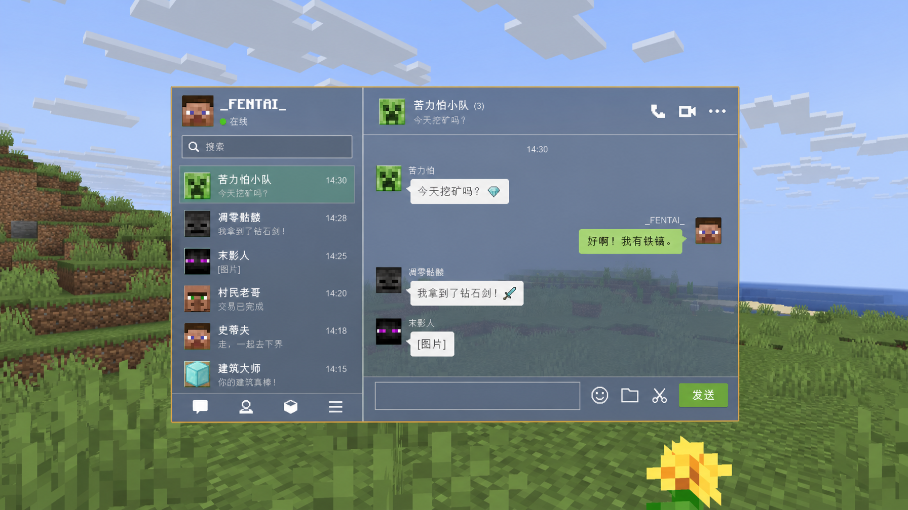
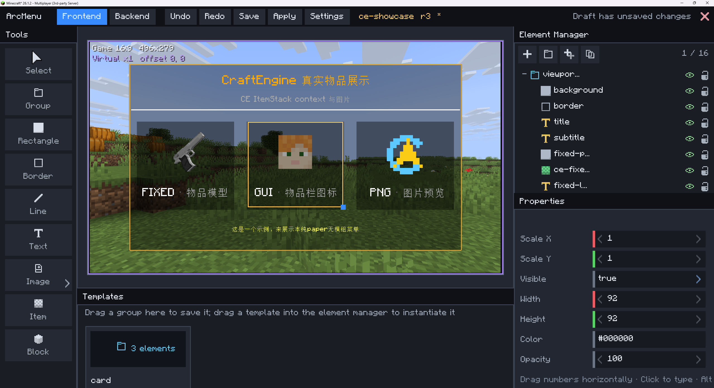

<p align="center">
  
</p>

<h1 align="center">ArcMenu</h1>

<p align="center"><strong>Build the interface your Minecraft server deserves.</strong></p>

<p align="center">
  <a href="README_zh_CN.md">简体中文</a> ·
  <a href="https://github.com/FENTAIIII/ArcMenu-Editor">Visual Editor</a> ·
  <a href="docs/第三方应用API.md">Application API</a> ·
  <a href="LICENSE">MIT License</a>
</p>

<p align="center">
  <a href="https://github.com/FENTAIIII/ArcMenu/actions/workflows/build.yml"></a>
  <a href="LICENSE"></a>
  
</p>

ArcMenu is an Advanced Menu Plugin that lets you add custom html-like menus, animations and screens to your Minecraft server — no client mods required. Everything ships through the resource pack (or even without resourcepack with limited functions) and runs server-side.

It uses new features that mojang had added to minecraft since 1.19.2, and it covers a larger variety of functions.

Want to create some different menus and animations that make you server unique among other’s? Then it’s the right place for you :)

> Login screens. Music players. Guild dashboards. Shops, quests, social apps and dungeon briefings. ArcMenu gives every system on a Paper server one visual language—and gives ordinary players the whole experience without a client mod.

ArcMenu is an open-source, server-driven UI framework for Minecraft. It combines player-private display entities, a fixed screen plane, resource-pack graphics, animation timelines, tooltips and a public application API to create interfaces that feel like part of the server itself.

The long-term idea is simple: a server should be able to grow an ecosystem of applications without every plugin inventing another disconnected inventory GUI. ArcMenu supplies the screen, input, navigation and lifecycle; integrations keep ownership of accounts, music, guilds, shops, quests and every other domain behind the interface.

> **Development preview:** the source is open for development and review. The configuration format, API and editor protocol may still change before the first stable release. Automated tests do not replace in-game visual and coordinate acceptance.

## See what the canvas can become

These concept interfaces show the kind of experience third-party plugins can build with ArcMenu. The login, music, dungeon and social systems pictured here are demonstrations of the API's potential; they are not bundled applications.

<table>
  <tr>
    <td width="50%"></td>
    <td width="50%"></td>
  </tr>
  <tr>
    <td align="center"><strong>Music that lives inside the world</strong></td>
    <td align="center"><strong>Account flows with a server identity</strong></td>
  </tr>
  <tr>
    <td></td>
    <td></td>
  </tr>
  <tr>
    <td align="center"><strong>Story and dungeon interaction</strong></td>
    <td align="center"><strong>A complete social workspace</strong></td>
  </tr>
</table>

The same foundation can host sign-in rewards, mail, auctions, skill trees, server settings, character selection, quest journals, matchmaking and systems that have not been designed yet. ArcMenu's job is to make those ideas share a coherent surface instead of forcing each integration to rebuild the camera, pointer, entity ownership and navigation stack.

## What already works

- **Server-rendered scenes:** text, images, items, blocks, rectangles, frames, lines and nested frontend groups are composed from YAML and shown only to the target player.
- **Two interaction modes:** touch mode and mouse mode share the same logical canvas, backend hit regions, tooltip rules, navigation and cleanup. Both currently use right click for their primary action.
- **Stable screen navigation:** menus and third-party applications reuse the first screen plane, so changing a route does not move the interface with the player's view.
- **Animation timelines:** menu enter, switch and exit transitions sit beside reusable node tracks for position, rotation, scale, text content and text opacity.
- **Resource workflows:** PNG images, custom tooltip skins, vanilla items and blocks, plus CraftEngine item models and pack composition.
- **Strict configuration:** menu definitions use one canonical YAML vocabulary, validation is explicit, and a failed reload leaves the last valid runtime state intact.
- **Application sessions:** addons receive a per-player surface, pointer events, optional mouse-mode hotbar scrolling, navigation, scheduling, private entity ownership and deterministic cleanup.
- **Internationalization:** the plugin and editor include English and Simplified Chinese, with additional server locale files supported.

## A live visual editor

The optional [ArcMenu Editor](https://github.com/FENTAIIII/ArcMenu-Editor) is an administrator-side Fabric mod. It surrounds a real 16:9 game viewport with tools, an element tree, reusable templates and property controls, while the authoritative menu continues to be rendered by the server.

<p align="center">
  
</p>

Frontend composition and backend interaction regions live on separate tabs. Administrators can select, resize, reorder, group, reparent, duplicate, template, undo, save and apply without making ordinary players install anything.

## The application layer

ArcMenu is designed to sit beneath feature plugins rather than absorb their business logic. An addon registers a namespaced application and gets a managed session:

```java
ArcMenuApi arcMenu = Bukkit.getServicesManager().load(ArcMenuApi.class);

ArcMenuApplicationHandle handle = arcMenu.registerApplication(
    this,
    "myplugin:shop",
    ArcMenuApplicationOptions.builder()
        .permission("myplugin.shop")
        .captureMouseScroll(true)
        .build(),
    context -> new ShopSession(context)
);
```

Applications can be opened from Java or through the single canonical YAML action:

```yaml
actions:
  right:
    - 'open-app: myplugin:shop featured'
```

See the [application API contract](docs/第三方应用API.md) and the [Java addon example](examples/java-addon/src/main/java/example/ExampleArcMenuAddon.java).

## Build from source

ArcMenu is a Maven multi-module project. The default build targets Paper 1.21.1 and Java 21:

```bash
git clone https://github.com/FENTAIIII/ArcMenu.git
cd ArcMenu
mvn clean verify
```

The shaded server plugin is written to `paper/target/ArcMenu-0.1.0-SNAPSHOT.jar`. Install it with ProtocolLib on Paper. PlaceholderAPI, Vault, PlayerPoints and CraftEngine are optional integrations; CraftEngine is the supported custom-content integration.

The target range is **Paper / Minecraft Java 1.21.1–26.2**. The automated compile and test matrix covers 1.21.1, 1.21.4, 1.21.6, 1.21.11, 26.1.2 and 26.2; runtime rendering must still be accepted separately on each server version. The current editor targets **Minecraft 26.1.2 with Fabric** and requires Java 25.

## Project map

| Module | Responsibility |
| --- | --- |
| `core` | YAML model, validation, geometry, behavior and animation logic |
| `api` | Stable types exposed to third-party Paper plugins |
| `paper` | Runtime sessions, rendering, input, resources and editor bridge |
| `protocol` | Dependency-free wire contract shared with ArcMenu Editor |
| `benchmarks` | Repeatable performance baselines |

Detailed design and validation notes live in [`docs`](docs). The source is available under the [MIT License](LICENSE); third-party acknowledgements are recorded in [THIRD_PARTY_NOTICES.md](THIRD_PARTY_NOTICES.md).
